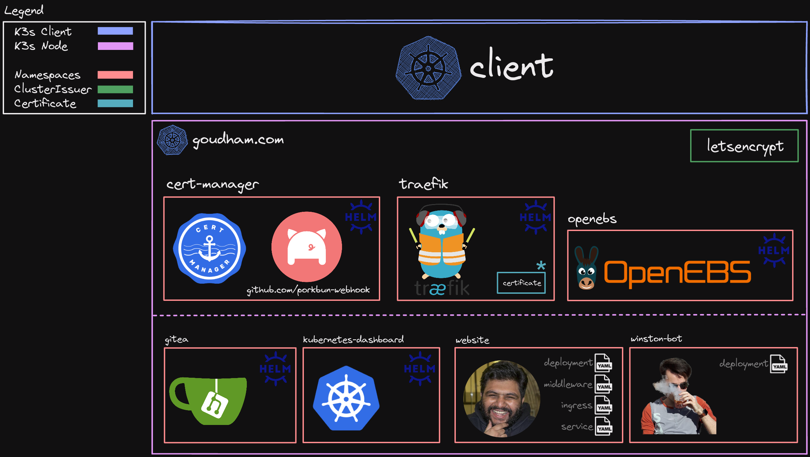

# Server Configuration

At the time of writing, I have a single 6 core [VDS from NetCup](https://www.netcup.eu/vserver/) that I use to host my personal
projects. Initially, I started out with docker and having folders of compose
files. I quickly ran into issues re-deploying multiple services at once,
shoehorning traefik configuration into docker and various other tidbits here and
there.

So I decided to bite the bullet and dive into the fabled/dreaded
_**Kubernetes**_.

It's important to note that this is **mostly for learning**, a single node
cluster isn't very effective and honestly makes things a lot harder in a lot of
places compared to docker config. However, I'm fascinated at the fact that you
can interact with a single node cluster the same way you'd do with hundreds of
clusters, it's a pretty powerful abstraction!

Also, _technically_ I'm using [**k3s**](https://k3s.io/) for this single node
cluster.

## High-Level Architecture



### Example Request


## Useful Commands

1. Get the Bearer Token

   ```shell
   kubectl -n <namespace> create token <user>
   ```

2. Load in Environment Variables via `.env` (Although, based on
   [this stackoverflow post](https://stackoverflow.com/questions/51419102/is-it-possible-to-source-a-env-file-to-create-kubernetes-secrets),
   there is some odd behaviour with the command)

   ```shell
   kubectl create secret generic <secret-name> --from-env-file=.env
   ```

3. Perform PVC Storage Expansion

   ```shell
   kubectl patch pvc <name> -p '{"spec":{"resources":{"requests":{"storage":"<amount>"}}}}'
   ```

4. Annotation to Allow Secret to be Managed by Sealed Secrets

   ```yaml
   annotations:
     sealedsecrets.bitnami.com/managed: "true"
   ```

## Tools Used

- [k3s](https://k3s.io/)
- [krew](https://krew.sigs.k8s.io/)
- [helm](https://helm.sh/)
- [sealed-secrets](https://sealed-secrets.netlify.app/)

## Liked Resources

- [Phippy goes to the zoo](https://www.youtube.com/watch?v=R9-SOzep73w&t=353s)
- https://blog.zachinachshon.com/k8s-dashboard/
- https://medium.com/codex/sealed-secrets-for-kubernetes-722d643eb658
- https://release.com/blog/kubernetes-secrets-management-a-practical-guide
- https://faun.pub/free-ha-multi-architecture-kubernetes-cluster-from-oracle-c66b8ce7cc37

## Acknowledgement

Sincere thanks to one of my best friends
[winston](https://github.com/nekowinston) for helping me set up the cluster,
troubleshoot configurations and taking the time to walk me through concepts. I
really couldn't have done it this fast without him!

## License

[MIT](LICENSE)
